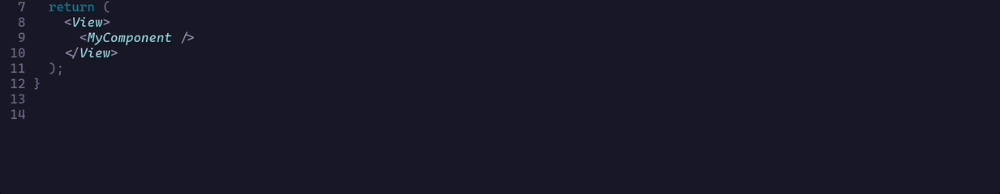

# @yet3/react-native-quick-style


<a href='https://www.npmjs.com/package/@yet3/svg2jspdf'>

</a>



Make changing often used styles on your components easier.

## Installation

```sh
npm install @yet3/react-native-quick-style
```

or

```sh
yarn add @yet3/react-native-quick-style
```

## Usage

```ts
import {
  qs,
  qsPrefix,
  withQuickStyle,
  QsProps,
} from '@yet3/react-native-quick-style';

const qsConfig = qs({
  style: {
    props: {
      mt: 'marginTop',
      mb: 'marginBottom',
      mr: 'marginRight',
      ml: 'marginLeft',
      bgColor: (_: 'red' | 'blue' | 'yellow') => 'backgroundColor',
      size: (value: 'sm' | 'lg') => {
        return {
          width: value === 'sm' ? 50 : 100
          height: value === 'sm' ? 25 : 50
        }
      }
    },
  },
  textStyle: {
    prefix: qsPrefix('text'),
    props: {
      size: 'fontSize',
      color: 'color',
    },
  },
});

interface Props extends QsProps<typeof qsConfig> {}

export const MyComponent = withQuickStyle(({ style, textStyle }: Props) => {
  ...
}, qsConfig);
```

Alternatively you can use `useQuickStyle` hook

```tsx
import {
  qs,
  qsPrefix,
  useQuickStyle,
  QsProps,
} from '@yet3/react-native-quick-style';
...
export const MyComponent = (props: Props) => {
  const { style, textStyle } = useQuickStyle(qsConfig, props)
  ...
};
```

```tsx
<MyComponent mt={12} mb={6} bgColor="blue" textSize={18} />
```

### QsConfig

|      **Name**      |           **Type**            | **Default value** |
| :----------------: | :---------------------------: | :---------------: |
| overrideStyleProps |     boolean \| undefined      |       true        |
|    stripQsProps    |     boolean \| undefined      |       false       |
|       prefix       |      string \| undefined      |     undefined     |
|       props        | [QsStyleProps](#qsstyleprops) |                   |

```tsx
qs({
  ...
  style: {
    overrideStyleProps: true,
    stripQsProps: false,
    prefix: qsPrefix('myPrefix'),
    props: {
      size: 'fontSize', // -> myPrefixSize
      color: 'color', // -> myPrefixColor
    },
  },
});
```

### QsStyleProps

key-value pair where key is name of qs' prop and value is name of css property:

```js
{
  mt: 'marginTop',
}
```

or function returning style object or name of css property:

```js
{
  size: (value: 'sm' | 'lg') => {
    return {
      width: value === 'sm' ? 50 : 100
      height: value === 'sm' ? 25 : 50
    }
  },
  bgColor: (_: 'red' | 'blue' | 'yellow') => 'backgroundColor',
}
```

### Options

```ts
const qsConfig = qs({
  ...
}, {
  overrideStyleProps: true, // DEFAULT
  stripQsProps: false, // DEFAULT
});
```

### LooseStringCmp

Use `LooseStringCmp` util type for nice auto-completion of literal string unions

```ts
import { LooseStringCmp } from '@yet3/react-native-quick-style';

const qsConfig = qs({
  style: {
    props: {
      mt: (value: LooseStringCmp<'sm' | 'md' | 'lg'> | number) => {
        ...
        return {
          marginTop: ...
        }
      },
      ...
    },
  },
  ...
});

...
```

## License

MIT

---

Made with [create-react-native-library](https://github.com/callstack/react-native-builder-bob)
